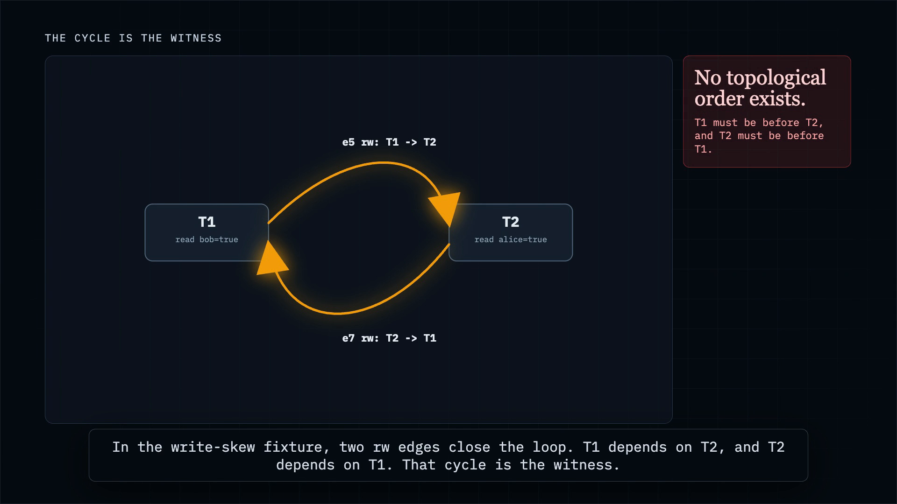
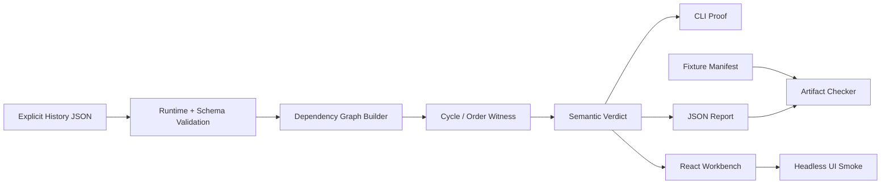

# IsoTrace

<h1 align="center">IsoTrace</h1>

<p align="center">
  <strong>Dependency graph witnesses for transaction isolation failures.</strong>
</p>

<p align="center">
  <a href="https://youtu.be/C0MLM3jucMY">Demo Video</a> ·
  <a href="paper/isotrace.pdf">Artifact Paper</a> ·
  <a href="paper/isotrace.tex">Paper Source</a>
</p>

<p align="center">
  
  
  
  
  
  <a href="https://youtu.be/C0MLM3jucMY"></a>
  
</p>

<p align="center">
  <a href="https://youtu.be/C0MLM3jucMY">
    
  </a>
</p>

IsoTrace is a bounded isolation-analysis workbench for explicit transaction histories. It turns point reads, writes, predicate reads, and realtime order into a dependency graph. If the graph contains a cycle, IsoTrace explains the isolation failure as a concrete witness: which transactions are implicated, which edges form the cycle, and which read/write or predicate facts produced those edges.

> A transaction can look valid in isolation while the full history has no legal serial order. IsoTrace makes that failure inspectable.

## Why This Matters

Transaction isolation failures are global shape problems. A local transaction can read a plausible state and make a plausible write, while the full history has no serial order that can explain every observed fact. Write skew, stale reads, and predicate-style phantom evidence are especially hard to inspect manually because the proof is spread across read provenance, write version order, predicate row membership, and realtime constraints.

IsoTrace makes that proof concrete. The hard object is the dependency graph. Histories go in; `ww`, `wr`, `rw`, `prw`, and `rt` edges come out; cycles become semantic verdicts; proof edges remain linked to the exact facts that created them. The claims are intentionally bounded so the artifact stays auditable.

## Quick Start

```bash
npm ci
npm run check
npm run smoke:ui
npm run dev
```

Open `http://127.0.0.1:5173/` to use the local workbench.

## 90-Second Demo Loop

The fastest proof path is the write-skew demo used in the video:

```bash
npm run demo
```

Look for:

- `Result: VIOLATION`
- `Anomaly: Write skew [write-skew]`
- `Implicated transactions: T1, T2`
- `Proof edges: e5 -> e7 (rw -> rw)`
- `Cycle witnesses`

Then launch the workbench:

```bash
npm run dev
```

Select `write_skew_doctors`, inspect the `Isolation Diagnosis` panel, and click an `rw` proof edge. The graph, edge table, selected edge, and transaction operation rows all point back to the same witness.

Supporting demos:

```bash
npm run demo:strict
npm run demo:phantom
npm run demo:predicate2
npm run demo:sql
```

- `npm run demo:strict`: strict stale read using an `rt` plus `rw` cycle.
- `npm run demo:phantom`: explicit predicate phantom-style dependency using `prw` / `prw` proof rows.
- `npm run demo:predicate2`: composite predicates plus modeled deletes.
- `npm run demo:sql`: constrained annotated SQL trace import, not general SQL parsing.

## What It Implements

| Component | What it does | Why it matters |
|---|---|---|
| Explicit history model | Represents transactions, reads, writes, predicate reads, timestamps, and aborted transactions | Keeps the analyzer deterministic and inspectable |
| Runtime + schema validation | Validates JSON histories, examples, and reports | Rejects ambiguous evidence instead of guessing |
| Dependency graph builder | Builds `ww`, `wr`, `rw`, `prw`, and `rt` edges | Turns history facts into proof structure |
| Cycle detector | Finds deterministic cycle witnesses and clean topological order witnesses | Shows why no serial order exists, or why one does |
| Semantic verdicts | Labels supported outcomes: write skew, strict stale read, dependency cycle, valid serial history, aborted-write handling, explicit predicate phantom-style evidence | Makes graph output readable without hiding the proof |
| Predicate proof rows | Stores before/after membership evidence for `prw` edges | Makes phantom-style claims portable and bounded |
| CLI reports | Prints human proof output or JSON report envelopes | Enables reproducible terminal workflows |
| Fixture contracts | Pins expected verdicts, edge kinds, cycle counts, and order witnesses | Prevents regression drift |
| React workbench | Visualizes histories, graph edges, verdicts, proof edges, and custom JSON imports | Makes the hard graph object legible |
| Headless UI smoke | Runs CLI proof checks and browser smoke without the in-app browser | Keeps the demo path automation-friendly |
| Benchmark smoke | Runs generated serial histories at several sizes | Catches gross analyzer regressions without making performance claims |

## Architecture



Core paths:

- `src/core/analyzer.ts`: graph construction.
- `src/core/graph.ts`: SCC, cycle extraction, topological order.
- `src/core/verdict.ts`: bounded semantic verdicts.
- `src/core/predicate.ts`: explicit predicate evaluation.
- `src/core/report.ts`: JSON report envelopes.
- `src/sql/trace.ts`: constrained annotated SQL trace importer.
- `src/cli.ts`: local analyzer CLI.
- `src/App.tsx`: React workbench over the same analyzer.
- `src/smoke/ui-smoke.ts`: CLI plus headless browser smoke.

## Current Artifact Proof

All results below were produced by local commands in this checkout.

| Proof surface | Verified result |
|---|---|
| Test suite | `10` test files, `86` tests passing via `npm run check` |
| Fixture contracts | `7` checked by `npm run artifacts:check` |
| Examples | `3` portable examples checked |
| JSON reports | Generated fixture reports and CLI JSON reports validate against schemas |
| Production build | Vite build succeeds inside `npm run check` |
| Benchmark smoke | Generated serial histories run inside `npm run check` |
| UI smoke | CLI proof checks and Playwright browser smoke pass via `npm run smoke:ui` |
| Audit | `npm audit --audit-level=moderate` reports `0` vulnerabilities |

`npm run artifacts:check` validates fixture coverage, fixture verdict contracts, examples, generated fixture reports, CLI JSON reports, fixture catalog output, and the CI workflow file.

## Command Surface

| Command | Purpose |
|---|---|
| `npm ci` | Install locked dependencies |
| `npm run check` | Typecheck, tests, artifact check, production build, benchmark smoke |
| `npm run smoke:ui` | CLI proof checks plus headless workbench smoke |
| `npm run demo` | Write-skew proof over `fixtures/write_skew_doctors.json` |
| `npm run demo:strict` | Strict stale-read proof over `fixtures/stale_read_strict.json` |
| `npm run demo:phantom` | Explicit predicate phantom-style proof over `fixtures/phantom_predicate_cycle.json` |
| `npm run demo:predicate2` | Composite predicate delete proof over `fixtures/composite_predicate_delete_cycle.json` |
| `npm run demo:sql` | Constrained annotated SQL trace import demo |
| `npm run artifacts:check` | Validate fixture contracts, examples, reports, schemas, catalog, CI workflow |
| `npm run fixtures` | Print checked-in fixture catalog |
| `npm run bench` | Run deterministic benchmark smoke |
| `npm run analyze -- <file>` | Analyze a custom history file |
| `npm run analyze -- <file> --validate` | Validate a history without running analysis |
| `npm run analyze -- <file> --json` | Emit JSON report envelope |
| `npm run analyze -- <trace.sql> --sql-trace` | Import constrained annotated SQL trace syntax |
| `npm run dev` | Launch the Vite workbench at `127.0.0.1` |
| `npm run build` | Typecheck and build the frontend |

## Fixture Catalog

Fixtures are synthetic, deterministic examples. They are product proof fixtures, not production traces.

| Fixture | Expected verdict | Key evidence |
|---|---|---|
| `aborted_write_ignored.json` | `aborted-write-ignored` | Aborted transaction excluded; clean order witness `T0 -> T2` |
| `composite_predicate_delete_cycle.json` | `predicate-dependency-cycle` | `prw/prw` cycle from composite predicates and modeled deletes |
| `serial_stock_decrement.json` | `valid-serial-history` | Clean order witness `T0 -> T1 -> T2` |
| `stale_read_strict.json` | `strict-stale-read` | `rt/rw` cycle under strict mode |
| `strict_serial_handoff.json` | `valid-serial-history` | Strict clean order witness `T0 -> T1 -> T2` |
| `phantom_predicate_cycle.json` | `predicate-dependency-cycle` | `prw/prw` cycle with before/after predicate row evidence |
| `write_skew_doctors.json` | `write-skew` | `rw/rw` cycle between `T1` and `T2` |

List the full catalog:

```bash
npm run fixtures
```

## Custom Histories

Users can paste or import JSON histories in the workbench. The same runtime validation path is used by the CLI and UI. Unsupported or ambiguous evidence is rejected rather than guessed.

Point reads must name read provenance:

```json
{
  "type": "read",
  "key": "doctor/bob_on_call",
  "value": true,
  "from": "T0"
}
```

Predicate reads are explicit modeled operations:

```json
{
  "type": "predicate-read",
  "table": "doctors",
  "predicate": { "column": "on_call", "op": "=", "value": true },
  "returnedRows": [{ "id": "alice", "on_call": true }]
}
```

Writes can carry relational row evidence for predicate membership checks:

```json
{
  "type": "write",
  "key": "doctors/bob/on_call",
  "value": true,
  "table": "doctors",
  "rowId": "bob",
  "fields": { "on_call": true },
  "mutation": "update"
}
```

See `examples/valid_history.json` and `examples/invalid_history_missing_from.json` for portable examples.

## SQL Trace Import

`--sql-trace` accepts a deliberately small annotated trace syntax:

```sql
BEGIN T1 AT 1 PROCESS worker-a
T1: SELECT id, on_call FROM doctors WHERE id = 'bob' AND on_call = true -> [{"id":"bob","on_call":true,"_from":"T0"}]
T1: UPDATE doctors SET on_call = false WHERE id = 'alice'
COMMIT T1 AT 2
```

Supported statements are `BEGIN`, `COMMIT`, `ROLLBACK`, `INSERT INTO ... VALUES ...`, single-column `UPDATE ... SET ... WHERE id = ...`, and `SELECT cols FROM table WHERE predicate -> JSON rows`. Returned `SELECT` rows must include `_from` provenance and `id` or `_id`.

This importer materializes explicit history evidence. It is not a live database adapter, not a general SQL parser, and not phantom inference from non-returned rows.

## Artifact Paper

PDF: [`paper/isotrace.pdf`](paper/isotrace.pdf)
Source: [`paper/isotrace.tex`](paper/isotrace.tex)

The paper documents the model, dependency graph construction, verdict layer, predicate-read evidence, fixture table, limitations, and reproducibility commands.

## Claims And Non-Claims

Claims:

- Reconstructs supported dependency edges from explicit histories: `ww`, `wr`, `rw`, `prw`, and `rt`.
- Emits supported semantic verdicts from deterministic graph evidence.
- Validates checked-in fixtures, examples, schemas, report envelopes, and fixture contracts.
- Produces reproducible CLI, JSON, and browser workbench proof surfaces.

Non-claims:

- Not live database certification.
- Not a live DB adapter.
- Not full SQL parsing.
- Not full Elle compatibility.
- Not full Adya anomaly coverage.
- Not general database verification.
- Not a production DB correctness claim.

## Limitations

- Explicit histories only. IsoTrace analyzes supplied evidence; it does not observe real workloads.
- Predicate phantom-style evidence only exists when predicate rows and insert/update/delete row evidence are supplied.
- No inferred missing rows, database snapshots, SQL ranges, joins, expressions, or hidden predicate reads.
- The SQL importer is constrained annotated trace syntax, not database SQL coverage.
- Strict mode requires numeric `begin` and `commit` timestamps on non-initial committed transactions.
- Equal non-initial commit timestamps are rejected because the v1 model needs unambiguous version order.
- Fixtures are synthetic and deterministic.
- Benchmark timings are local smoke measurements, not production performance claims.

## License

MIT. See [`LICENSE`](LICENSE).
